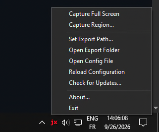

- Small c project to capture monitor screenshot using jxl image codec on windows.
  
- just run jxlshot.exe and it export a screenshot to picture path folder
  
- to use it as screenshot app run the tray executable it will run in background and give you two option either capture specific region or whole monitor and path for export or picture folder as default

- there is also keyboard shortcut you either press imprscreen key to capture full screenshot or ctrl+imprscreen to pick a region to screenshot(you have the freedom to change it in ini config too)

- there is also config file for controlling lossy compression or keep lossless as default

- there is also HDR support too (still experimental), alongside DPI awreness and correct colors awareness.

- no need for installation or anything just keep the folder somewhere and make sure its path stay as it is and run .bat file to make it run with windows always on startup

- or just use installer to do for you all of that!

- and nothing fancy just do what it should do !

- Why JXL? Because its the modern image format and take less space than other file format and has great compression.

- ENJOY!
