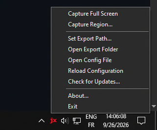

    
    

- Small c project to capture monitor screenshot using jxl image codec on windows.
> The entire idea here is to build a screenshot app using jxl  to achieve great compression and good quality unlike jpeg which give bad quality and bad colors and png has mid compression
- to use it as screenshot app run the installer and it will run in background and give you two option either capture specific region or whole monitor and path for export or picture folder as default

- there is also keyboard shortcut you either press imprscreen key to capture full screenshot or ctrl+imprscreen to pick a region to screenshot(you have the freedom to change it in ini config too)

- and it has also config file for controlling lossy compression or keep lossless as default

- also there is HDR support too (still experimental), alongside DPI awreness and correct colors awareness.

- ***. . .***
